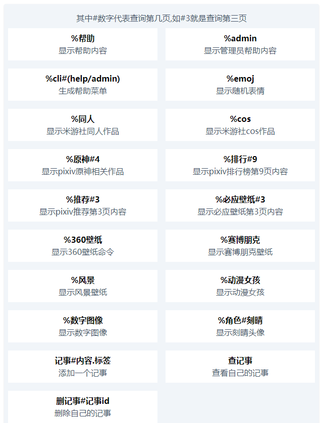

# keqing-bot

一个简单的qq群机器人,可以查询米游社同人图,pixiv图片,等等

## 声明

项目仅供学习交流使用，严禁用于任何商业用途和非法行为

## 用法

> 需要[Node.js](https://nodejs.org/) 环境,版本最好是v16以上

安装依赖

```shell
yarn install
```

然后把src文件夹下的`config.example.ts`改为`config.ts`,里面的account和pass修改为你自己的,完成后运行

三种运行方法,选择一种即可

1.前台运行

```shell
yarn build && yarn start 
```

2.后台运行

```shell
yarn back
```

3.开发调试

```shell
yarn devbuild
```

按照提示进行登录,enjoy!

## 指令

`%帮助`或者`%help`查看指令信息  


## License

[](https://github.com/yzqdev/keqing-bot/blob/main/LICENSE)  
GPL License © 2022 [yzqdev](https://github.com/yzqdev)

## 鸣谢

- 感谢 JetBrains 提供的免费开源 License：  


